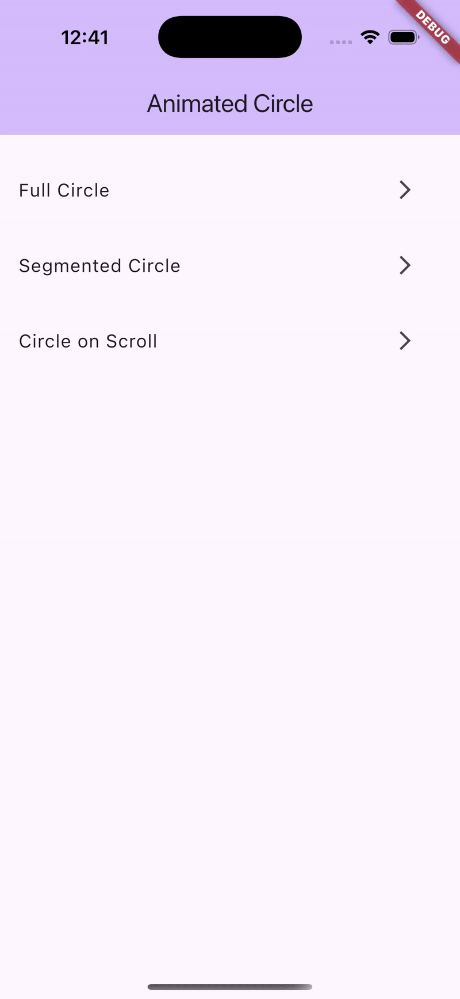

# Flutter Animated Circle

A highly customizable Flutter package for creating beautiful animated circles that can be used as progress indicators, pie charts, or visual elements in your Flutter applications.

<p align="center">
  
</p>

## Features

- **Full Circle Animation**: Create smooth, animated circular progress indicators
- **Segmented Circle**: Build multi-colored circle segments perfect for pie charts and data visualization
- **Scroll-Triggered Animation**: Automatically animate circles when they become visible during scrolling
- **Customizable Appearance**: Control colors, stroke widths, borders, animation timing, and more
- **Easy to Use**: Simple API designed for both basic and advanced use cases

## Getting Started

### Installation

Add `flutter_animated_circle` to your `pubspec.yaml` file:

```yaml
dependencies:
  flutter_animated_circle: ^0.1.0
```

Or install via command line:

```bash
flutter pub add flutter_animated_circle
```

### Import

```dart
import 'package:flutter_animated_circle/flutter_animated_circle.dart';
```

## Usage

### Basic Full Circle

```dart
AnimatedCircleView(
  circlePainterConfig: CirclePainterConfig.full(
    fillColor: Colors.blue,
    borderColor: Colors.blue.shade800,
    strokeWidth: 16.0,
    borderWidth: 20.0,
  ),
  duration: Duration(milliseconds: 800),
)
```

### Segmented Circle

```dart
AnimatedCircleView(
  circlePainterConfig: CirclePainterConfig.segmented(
    segments: [
      CircleSegment(
        fillColor: Colors.blue, 
        borderColor: Colors.blue.shade800,
        ratio: 0.6, // 60% of the circle
      ),
      CircleSegment(
        fillColor: Colors.green, 
        borderColor: Colors.green.shade800,
        ratio: 0.4, // 40% of the circle
      ),
    ],
    strokeWidth: 16.0,
    borderWidth: 20.0,
  ),
  duration: Duration(milliseconds: 800),
)
```

### Scroll-Triggered Animation

```dart
final ScrollController scrollController = ScrollController();

// In your build method:
ListView.builder(
  controller: scrollController,
  itemBuilder: (context, index) => AnimatedCircleView(
    circlePainterConfig: CirclePainterConfig.full(
      fillColor: Colors.amber,
      borderColor: Colors.amber.shade800,
    ),
    scrollController: scrollController, // Circle animates when visible
    duration: Duration(milliseconds: 600),
  ),
)
```

### Advanced Customization

```dart
AnimatedCircleView(
  circlePainterConfig: CirclePainterConfig.segmented(
    segments: [
      CircleSegment(fillColor: Colors.red, borderColor: Colors.redAccent, ratio: 0.25),
      CircleSegment(fillColor: Colors.blue, borderColor: Colors.blueAccent, ratio: 0.25),
      CircleSegment(fillColor: Colors.green, borderColor: Colors.greenAccent, ratio: 0.25),
      CircleSegment(fillColor: Colors.purple, borderColor: Colors.purpleAccent, ratio: 0.25),
    ],
    separatorAngle: 0.05, // Space between segments
    baseColor: Colors.grey.shade200, // Background color
  ),
  duration: Duration(milliseconds: 1200),
  fadeInDuration: Duration(milliseconds: 300),
  curve: Curves.easeInOutCubic,
  strokeWidth: 18.0,
  borderWidth: 22.0,
  onAnimationCompleted: () => print("Animation completed!"),
)
```

## Customization Options

### AnimatedCircleView Properties

| Property | Type | Description |
|----------|------|-------------|
| `circlePainterConfig` | `CirclePainterConfig` | Configuration for circle appearance and segments |
| `scrollController` | `ScrollController?` | Controller to trigger animation when visible in scroll view |
| `onAnimationCompleted` | `VoidCallback?` | Function called when animation completes |
| `duration` | `Duration` | Duration of the circle drawing animation |
| `fadeInDuration` | `Duration` | Duration of fade-in effect when becoming visible |
| `curve` | `Curve` | Animation curve for the drawing animation |
| `strokeWidth` | `double` | Width of circle's stroke |
| `borderWidth` | `double` | Width of circle's border |

## Examples

See the `/example` folder for complete working examples showing different configurations and use cases.

## Additional Information

- Compatible with Flutter 3.0.0 and above
- Open source under the MIT License
- Issues and feature requests are welcome on the GitHub repository
